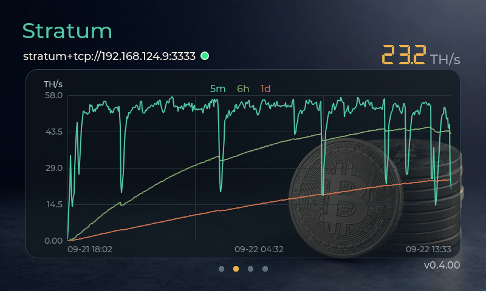
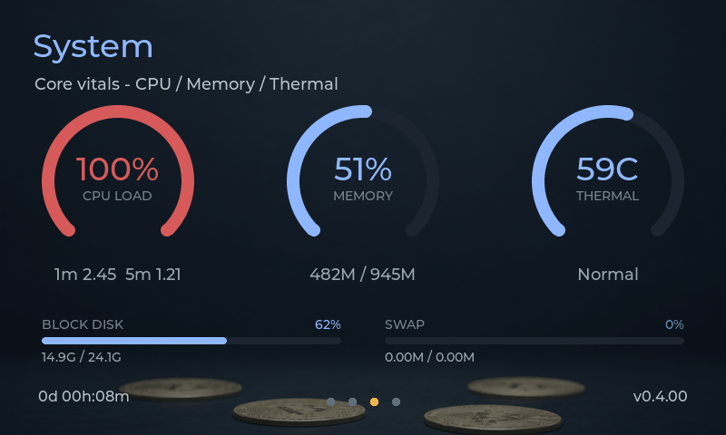
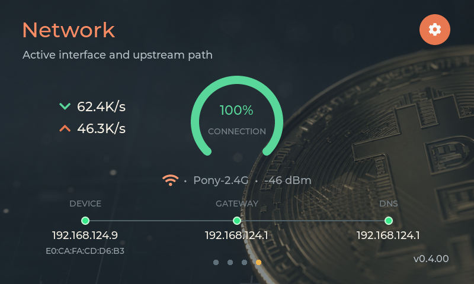
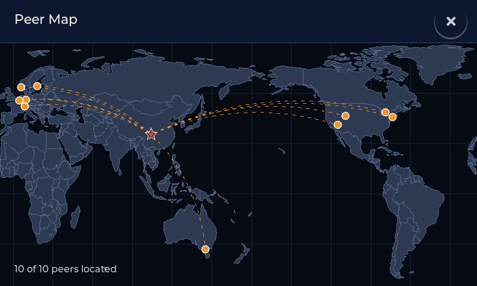
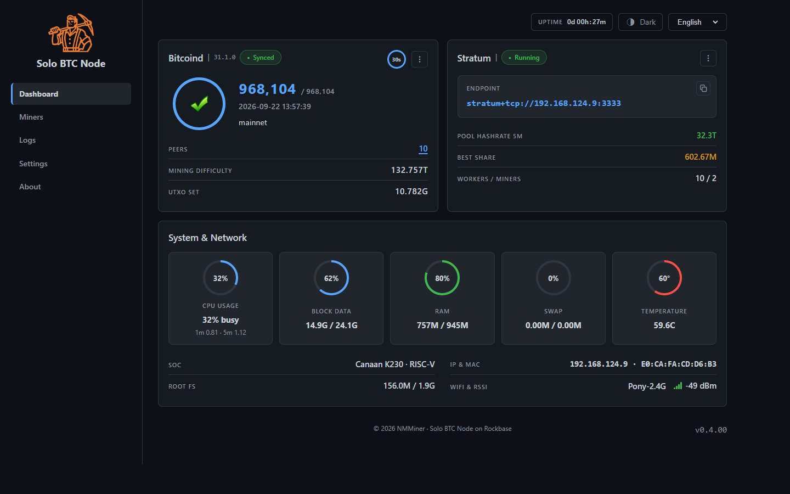
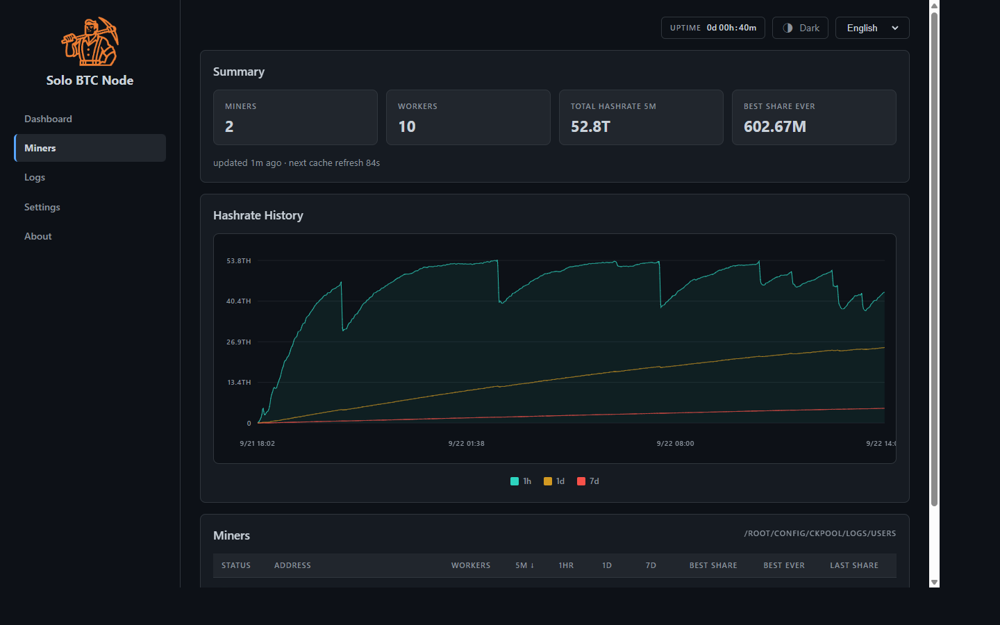
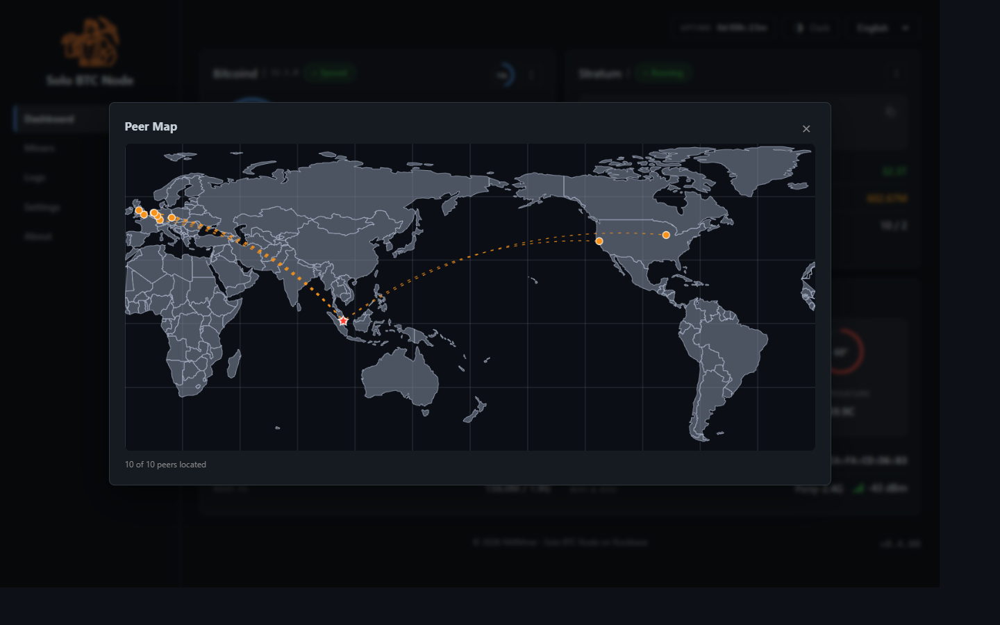

# Rockbase — 比特币独矿一体机

**[ 中文 ]** · [ English ](#english)

---

## 中文

### 这是什么？

Rockbase 是一台**开箱即用的比特币节点 + 独矿（Solo Mining）一体机**。

插上电源、连上网络，它就开始做两件事：

1. **运行一个比特币验证节点** —— 自己下载、验证区块链上的每一个区块，不依赖任何第三方数据（采用裁剪模式，只保留最近的区块数据以节省空间）；
2. **提供本地 Stratum 矿池接口** —— 把你的矿机接进来，直接挖比特币主网，挖到的区块奖励 100% 归你。

不需要装系统、不需要配软件、不需要懂命令行。设备自带一块彩色触摸屏和一套网页控制台，所有状态一目了然。

### 硬件规格

| 项目 | 参数 |
|------|------|
| 处理器 | Canaan K230（RISC-V 架构） |
| 内存 | 1 GB |
| 屏幕 | 彩色触摸屏（480×800 物理分辨率） |
| 网络 | 板载 WiFi + USB 转有线网卡（自动获取 IP） |
| 存储 | SD 卡（存放区块链数据） |
| 供电 | DC 电源 |

### 触摸屏界面

屏幕上有 4 个页面，**上下滑动即可切换**：

**① Bitcoind 页** —— 节点状态总览：当前区块高度、同步进度、连接的对等节点数、挖矿难度、UTXO 集大小。



**② Stratum 页** —— 挖矿状态：矿池算力曲线、在线矿工数、最佳份额。


**③ System 页** —— 设备健康：CPU 占用、温度、内存、区块链数据占用。



**④ Network 页** —— 网络信息：IP 地址、MAC 地址、WiFi 信号强度。



**Peer Map（对等节点地图）** —— 在 Bitcoind 页点击节点数，可以看到一张世界地图，实时显示你的节点正在和全球哪些节点通信，连线动画表示数据流动方向。



### 网页控制台

用电脑或手机浏览器访问 `http://<设备IP>`（IP 可在 Network 页或路由器里查到），即可打开网页控制台。支持 10 种语言（英文、中文、西班牙语、法语、德语、葡萄牙语、俄语、日语、韩语、阿拉伯语），在页面右上角切换。

**Dashboard（仪表盘）** —— 一屏看全：节点同步状态、Stratum 端点与算力、CPU / 内存 / 温度 / 网络等系统指标。



**Miners（矿工）** —— 每台矿机的算力历史曲线、贡献份额，方便确认矿机是否正常工作。



**About（关于 / 固件更新）** —— 查看版本信息，并在这里进行固件升级（见下文）。



### 网络连接

Rockbase 支持两种联网方式，开机时自动识别：

- **板载 WiFi** —— 连接家里的无线网即可；
- **USB 转有线网卡** —— 插一根 USB 网卡走有线网络，更稳定。兼容常见芯片的 USB 网卡（Realtek RTL8152/RTL8153、ASIX AX88179 千兆、AX88772 百兆等），即插即用，无需安装驱动。

两种方式都自动获取 IP（DHCP）。如果同时接了 USB 网卡和 WiFi，优先使用 USB 有线网络。

### 接入矿机

1. 确认矿机与 Rockbase 在**同一局域网**内；
2. 在矿机里填写矿池地址：

   ```
   stratum+tcp://<Rockbase的IP>:3333
   ```

   （IP 可在 LCD 的 Network 页或网页控制台看到；用户名/密码随意填写，例如 `worker1` / `x`）
3. 保存后，矿机开始向 Rockbase 提交工作量。在 LCD 的 Stratum 页或网页 Miners 页能看到算力曲线出现，即接入成功。

> 提示：建议给 Rockbase 在路由器里绑定固定 IP，避免重启后 IP 变化导致矿机断连。

### 固件升级

Rockbase 内置 **A/B 双分区 OTA 升级**，升级过程断电也不会变砖：

1. 打开网页控制台的 **About** 页；
2. 点击 **Check for Updates** 检查是否有新版本；
3. 有新版时点击 **Update Now**，设备会自动下载、校验签名、写入备用分区并重启；
4. 如果新固件启动异常，设备会**自动回滚**到旧版本。

所有固件包都发布在本仓库的 [Releases](https://github.com/NMminer1024/btc-solo-node-release/releases) 页面，设备检查更新时会自动从那里获取。

### 版本与发布说明

- 版本号格式：`vX.Y.ZZ`（如 `v0.4.00`），完整固件包名形如
  `v0.4.00-rockbase-k230-20260922-da181f46-ota`
  （版本号 - 平台 - 构建日期 - 代码指纹 - ota）；
- 所有固件包都经过**签名**，设备升级时会验证签名，确保固件来源可信；
- 历史版本可在 [Releases](https://github.com/NMminer1024/btc-solo-node-release/releases) 页面下载。

### 常见问题

**Q：刚开机要等多久才能用？**
A：首次启动需要下载并验证整个区块链（下载量约 15 GB），时间取决于网速，通常需要几个小时到一天。设备采用裁剪模式，验证完成后只保留最近约 4 GB 的区块数据。同步期间矿机可以正常接入，但出块概率极低；同步完成后即可正常挖矿。

**Q：矿机连不上怎么办？**
A：先确认两者在同一局域网；再确认矿机填的地址是 `stratum+tcp://IP:3333`（注意是 3333 端口）；最后看 LCD 的 Stratum 页是否显示 Running。

**Q：设备会发烫吗？**
A：正常工作温度约 55–65°C，System 页可实时查看。请保持设备周围通风良好。

**Q：如何重置设备？**
A：断电重新上电即可恢复。区块链数据保存在 SD 卡中，不会因重启丢失。

### 支持

- 固件下载与版本说明：[Releases](https://github.com/NMminer1024/btc-solo-node-release/releases)
- 问题反馈：请通过 GitHub Issues 提交，附上 LCD 截图或网页控制台截图会很有帮助。

---

<a id="english"></a>

## English

### What is this?

Rockbase is an **out-of-the-box Bitcoin node + solo mining all-in-one device**.

Plug in power, connect to your network, and it starts doing two things:

1. **Running a Bitcoin validating node** — it downloads and verifies every block on the blockchain itself, with no reliance on third-party data (in pruned mode, keeping only recent block data to save space);
2. **Serving a local Stratum mining endpoint** — plug your miner into it and mine the Bitcoin mainnet directly. Any block reward you find is 100% yours.

No OS to install, no software to configure, no command line required. The device ships with a color touchscreen and a web console, so every status is visible at a glance.

### Hardware Specifications

| Item | Spec |
|------|------|
| Processor | Canaan K230 (RISC-V) |
| Memory | 1 GB |
| Display | Color touchscreen (480×800 physical) |
| Network | On-board WiFi + USB-to-Ethernet adapter (DHCP) |
| Storage | SD card (blockchain data) |
| Power | DC power adapter |

### Touchscreen UI

The screen has 4 pages — **swipe up/down to switch**:

**① Bitcoind page** — Node overview: current block height, sync progress, connected peers, mining difficulty, UTXO set size.


**② Stratum page** — Mining status: pool hashrate chart, online workers, best share.


**③ System page** — Device health: CPU usage, temperature, memory, blockchain data usage.


**④ Network page** — Network info: IP address, MAC address, WiFi signal strength.


**Peer Map** — On the Bitcoind page, tap the peer count to open a world map showing which nodes around the globe your node is talking to, with animated lines indicating data flow direction.


### Web Console

Open `http://<device-IP>` in any browser (the IP is shown on the Network page or in your router). The console supports 10 languages (English, 中文, Español, Français, Deutsch, Português, Русский, 日本語, 한국어, العربية) — switch in the top-right corner.

**Dashboard** — Everything on one screen: node sync status, Stratum endpoint & hashrate, CPU / memory / temperature / network metrics.


**Miners** — Per-miner hashrate history and contributed shares, so you can confirm each miner is working.


**About** — Version info and the firmware update entry (see below).


### Network Connection

Rockbase supports two network paths, auto-detected at boot:

- **On-board WiFi** — just join your home wireless network;
- **USB-to-Ethernet adapter** — plug in a USB NIC for a more stable wired connection. Common USB NIC chips are supported out of the box (Realtek RTL8152/RTL8153, ASIX AX88179 gigabit, AX88772 100M, etc.) — no drivers needed.

Both use DHCP. If a USB NIC and WiFi are both available, the USB wired path takes priority.

### Connecting Your Miner

1. Make sure your miner and Rockbase are on the **same LAN**;
2. In your miner's pool settings, enter:

   ```
   stratum+tcp://<Rockbase-IP>:3333
   ```

   (The IP is visible on the LCD Network page or in the web console. Username/password can be anything, e.g. `worker1` / `x`.)
3. Save. Your miner starts submitting work to Rockbase. When the hashrate chart appears on the LCD Stratum page or the web Miners page, you're connected.

> Tip: assign Rockbase a static IP in your router so miners don't lose connection after reboots.

### Firmware Updates

Rockbase uses **A/B dual-slot OTA updates** — even a power loss mid-update won't brick the device:

1. Open the **About** page in the web console;
2. Tap **Check for Updates** to see if a new version is available;
3. If one is, tap **Update Now** — the device downloads, signature-verifies, writes the standby slot, and reboots automatically;
4. If the new firmware fails to boot, the device **rolls back automatically** to the previous version.

All firmware packages are published on the [Releases](https://github.com/NMminer1024/btc-solo-node-release/releases) page, which the device checks automatically when looking for updates.

### Versioning & Releases

- Version format: `vX.Y.ZZ` (e.g. `v0.4.00`). Full package names look like
  `v0.4.00-rockbase-k230-20260922-da181f46-ota`
  (version - platform - build date - code fingerprint - ota);
- Every firmware package is **signed**; the device verifies the signature during update to guarantee authenticity;
- All historical versions are available on the [Releases](https://github.com/NMminer1024/btc-solo-node-release/releases) page.

### FAQ

**Q: How long until it's ready after first power-on?**
A: The first boot downloads and verifies the entire blockchain (~15 GB of downloads). Depending on your connection this takes several hours to a day. The device runs in pruned mode, keeping only the most recent ~4 GB of block data after verification. You can connect miners during sync, but block-finding probability is negligible until sync completes.

**Q: My miner can't connect — what do I check?**
A: Confirm both devices are on the same LAN; confirm the pool URL is `stratum+tcp://IP:3333` (port 3333); check that the LCD Stratum page shows "Running".

**Q: Does the device run hot?**
A: Normal operating temperature is about 55–65°C, viewable live on the System page. Keep the area around the device well ventilated.

**Q: How do I reset the device?**
A: Power cycle it. Blockchain data lives on the SD card and survives reboots.

### Support

- Firmware downloads & release notes: [Releases](https://github.com/NMminer1024/btc-solo-node-release/releases)
- Bug reports: please open a GitHub Issue — attaching an LCD screenshot or web console screenshot helps a lot.
